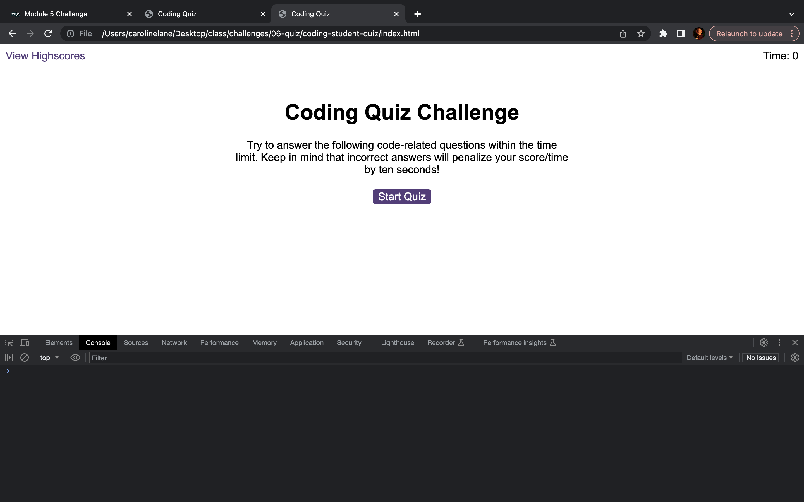
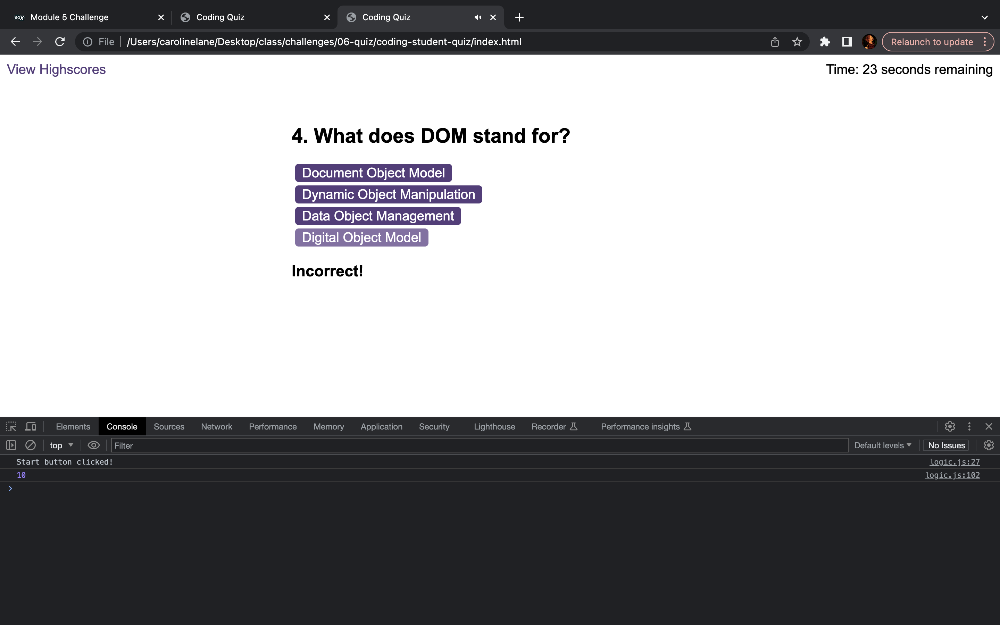
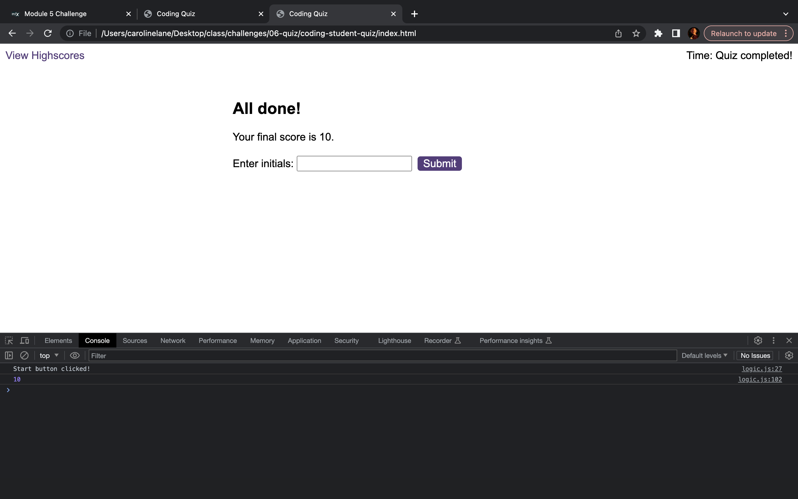
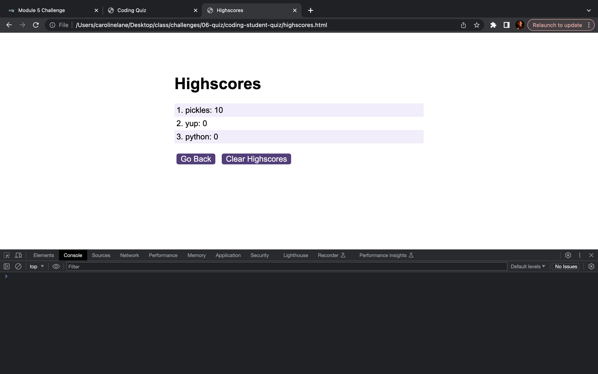

# coding-student-quiz
A quiz for coding students.

https://cazbella.github.io/coding-student-quiz/ 

This project is designed to solve the challenges set out in the Module 6 assignment. It primarily uses JavaScript.  

## Description

This project is an application that presents the user with quiz questions about intermediate level javascript. 

Please find a screenshot below of the landing area with the console;

This project aims to show my current skills in using JavaScript that we have learned on the course so far, solving the requirements of the Module 06 Challenge in the EdX Frontend Web Development Bootcamp. 

One of the hardest things was debugging the errors to work out that I needed to remove the 'hide' class in the html/css to make the 1st question reveal itself! I also spent a lot of time trying to create a keyup even for the submission button, but everything I did broke the code! Eventually I worked it out and that was very satisfying.

I have completed a JavaScript course previously, but I had not encountered some of the syntax required. I have used a lot of the logic that we talked about in class this week. 

## Usage

Please find a link to the live application here; 

https://cazbella.github.io/coding-student-quiz/ 

1. Please click the 'Start Quiz' button to begin. The first question should appear. The user should use the mouse to click an answer of their choice. 

2. If the answer is correct, the correct tone will sound. If the answer is incorrect, the incorrect tone will sound. I also added a div in the html that flashes 'correct' or 'incorrect' for 1 second, as shown in the screenshot below. 

3. The user works through the 10 questions. If they select a wrong answer, 10 seconds is taken off the timer. When all the questions have been answered, the following screen should appear; 

4. When the user submits their details, their score and initials appear in an ordered list, as shown in the screenshot below. I added functionality here for the enter key to be used to input initials, as well as a mouse click. 

Pressing the 'Clear Highscores' button removes the information from the list. 

If the user clicks the 'Go Back' button at this point the process begins again. 

__The Console__
_______________
It is a requirement that there are no errors in the console.

Please open the HTML file in the browser and inspect the page. Then please view the console. You should see that there are no errors. The screenshots also show this. 

__A Note about Pseudocode__
_____________________________

The JavaScript files that contain this code contains lots of comments. The tutor was asked if this was good practice and the advice given was that as I am new to web development, there should be lots of comments at this stage. Hopefully the comments and the commits explain the process I followed to complete the assignment. I have also made notes here to help me remember the process and what the syntax means. I feel that I am progressing in this area and need to use fewer comments this time. 

__A Note about Function__
_________________________

I have tried several things to try and delay the next question by a second in order for the notification of correct or incorrect to display before the next question appears. I am still working on this. 

## References

I completed the Northcoders pre-work JavaScript module, so I had a foundation knowledge of some of the concepts covered. I have used google a lot this week, including Stack Overflow, W3 schools and MDN web docs. I have used ask BCS this week for help with GitHub. We also used the 1:1 tutor session this week to look at assignment 6. One page in particular that I used this week was;
https://stackoverflow.com/questions/75575841/how-can-i-initiate-a-quiz-by-clicking-on-a-button-in-javascript

## Contributing

I would very much appreciate some feedback on the methods I have used to achieve the task. Is this the most concise code I could have used? I would also like to know if the readme layout and content was appropriate for the task if possible please. 

## License

[MIT](https://choosealicense.com/licenses/mit/)